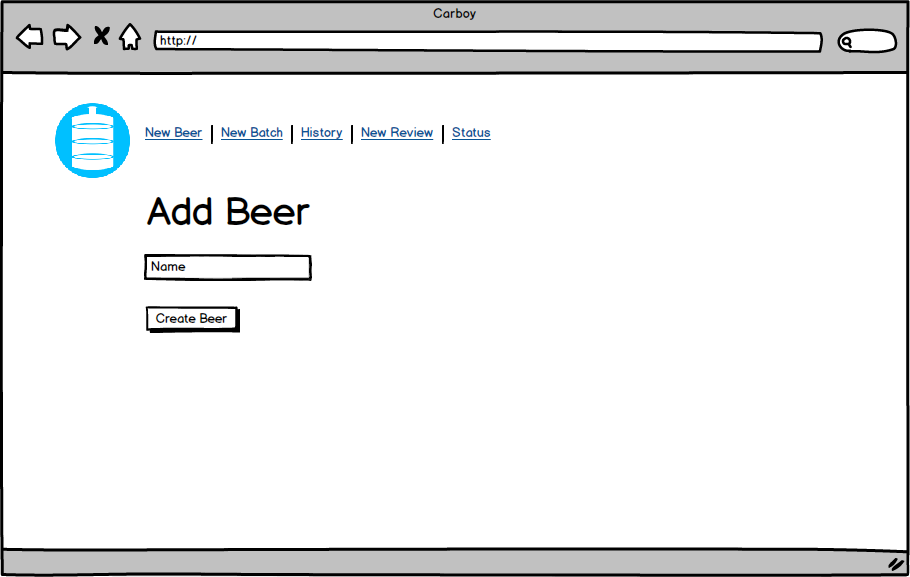

#----CARBOY---- 

---

##Scope
<i>Carboy</i> helps homebrewers track their beers and batch notes.

Combining a powerful repository of fermentables, hops, yeasts, and specialty ingredients, and the flexibility needed for invidual brewing styles, <i>Carboy</i> gives homebrewers a central application for all record keeping. 

At its core, <i>Carboy</i> lets users log beers and individual batches of each. Because no two batches are identicals, <i>Carboy</i> lets the brewmaster specify exactly what goes into each batch. Want to switch up the ratios of English Chocolate Malt and Black Malt in your bourbon barrel stout? Throw in a little 4.0 lovibond DME to up the F.G.? No problem. We've got you covered. <i>Carboy</i> gives complete flexibility for every batch of beer.

In addition to brew session notes, brewmasters can also log their tasting notes as beers mature.

##Milestones
|       | Monday    | Tuesday   |Wednesday  |Thursday   |  Friday  |
|:----- |:-----     |:-----     |:-----     |:-----     |:-------- |
| **Morning Deliverable** | Work Plan, website blocking | Seeded database with API refresh | Northern Brewer recipe pull built, User account validation | Unstyled website complete | Complete project hosted on Heroku and GitHub |
| **Day Work** | Model creation & API integration | Data Model hosted on Heroku | Frontend frameworks | Frontend styling and layouts | **Presentation**
| **Evening Work** | Ingredient seeding from API | Nokogiri & Web Scraping | Bootstrap integration | Frontend development | -- |

##API
 
<i>Carboy</i> uses the BreweryDB API to maintain current information on commonly used brewing ingredients. It also lets users choose from their own ingredient lists, as whim and wit desire. 

##Recipes
<i>Schmertzler Microbrewing</i> partners with <a href="www.northernbrewer.com">Northern Brewer</a>--one of the largest homebrew suppliers in the United States--for the majority of our infrastructure, materials, and ingredients. To assist the wide range of homebrewers who also enjoy Northern Brewer's range of recipes and products, <i>Carboy</i> pre-populates its beer directory with Northern Brewer's extract beer recipes.

##Gems
<i>Carboy</i> is a Ruby on Rails application, using a variety of gems to support development. Northern Brewer recipes are provided through a page-scrape using HTTParty running on Nokogiri.

##Mockups
###Landing Page

###New Beer/Batch

###Edit Brew Page

###Batch Information

##DB Models
